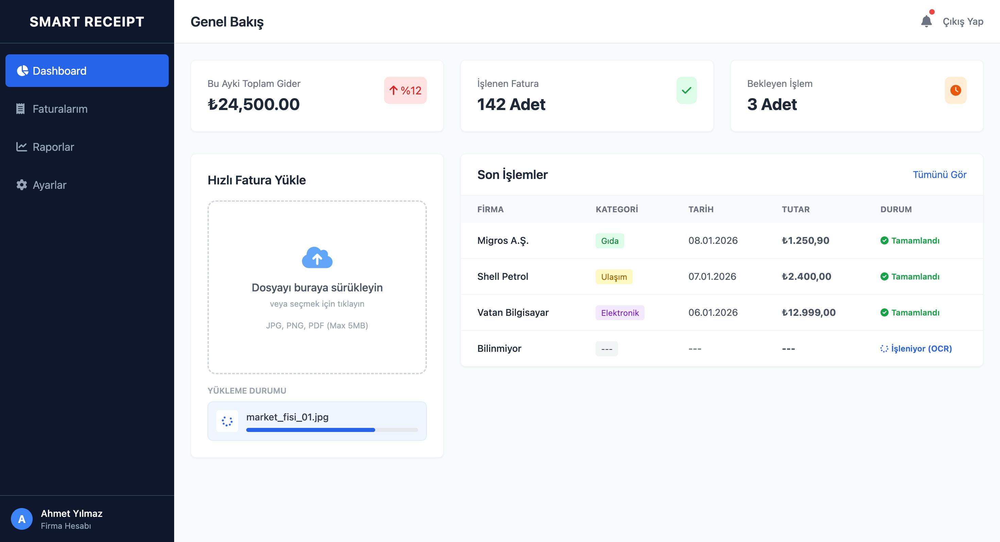
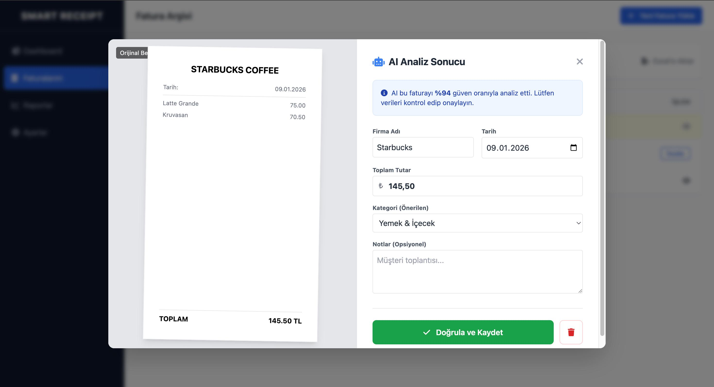
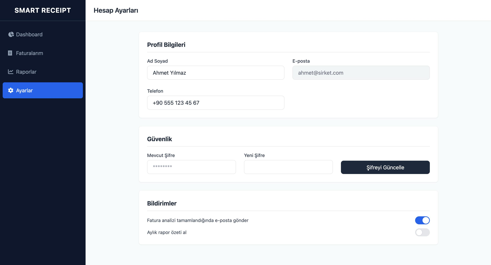
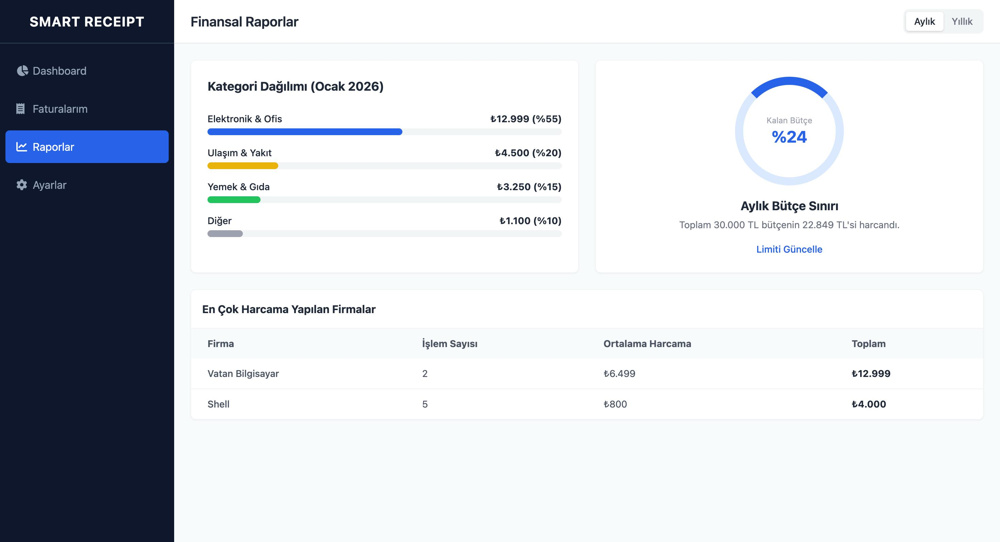

# Smart Receipt Analyzer (Frontend)

   

## 📖 Overview

**Smart Receipt Analyzer** is a web-based expense tracking application designed to automate the process of digitizing receipts. Built as a **Computer Engineering Semester Project**, this system aims to eliminate manual data entry by leveraging **OCR (Optical Character Recognition)**

This repository contains the **Frontend** architecture of the project, focusing on a responsive, user-friendly dashboard and interactive data visualization.

---

## 🚀 Key Features

* **🔐 Authentication System:** Secure Login and Registration pages with a modern split-screen UI.
* **📊 Interactive Dashboard:** Real-time summary of expenses, monthly trends, and quick actions.
* **🧾 Smart Receipt Management:**
    * Upload interface for digital receipts (Image/PDF).
    * **OCR Verification Modal:** A dedicated interface to verify and correct AI-extracted data side-by-side with the original receipt image.
* **📈 Financial Reports:** Visual breakdown of expenses by category (Food, Transport, Office, etc.) using simulated data visualization.
* **⚙️ Settings:** Profile management and application preferences.

---

## 🛠️ Technology Stack

* **Framework:** React (Vite)
* **Language:** TypeScript
* **Styling:** Tailwind CSS
* **Icons:** React Icons
* **Routing:** React Router DOM
* **Planned Backend:** AWS (Lambda, S3, Textract, DynamoDB)

---

## 📸 Screenshots

### 1. Dashboard Overview


### 2. OCR Analysis


### 3. Login Interface


### 4. Settings Interface


### 5. Report Interface


---

## 💻 Getting Started

Follow these steps to run the project locally.

### Prerequisites
* Node.js (v18 or higher)
* npm

### Installation

1.  **Clone the repository**
    ```bash
    git clone [https://github.com/CetinkayaUgur/SmartReceiptAnalyzer-Frontend.git](https://github.com/CetinkayaUgur/SmartReceiptAnalyzer-Frontend.git)
    cd SmartReceiptAnalyzer-Frontend
    ```

2.  **Install dependencies**
    ```bash
    npm install
    ```

3.  **Run the development server**
    ```bash
    npm run dev
    ```

4.  **Open in Browser**
    Visit `http://localhost:5173` to view the application.

---

## 📂 Project Structure

```bash
src/
├── components/     # Reusable UI components (Sidebar, Buttons, etc.)
├── layouts/        # Page layouts (DashboardLayout for persistent sidebar)
├── pages/          # Main views (Dashboard, Receipts, Login, etc.)
├── App.tsx         # Main application component & Routing logic
└── main.tsx        # Entry point